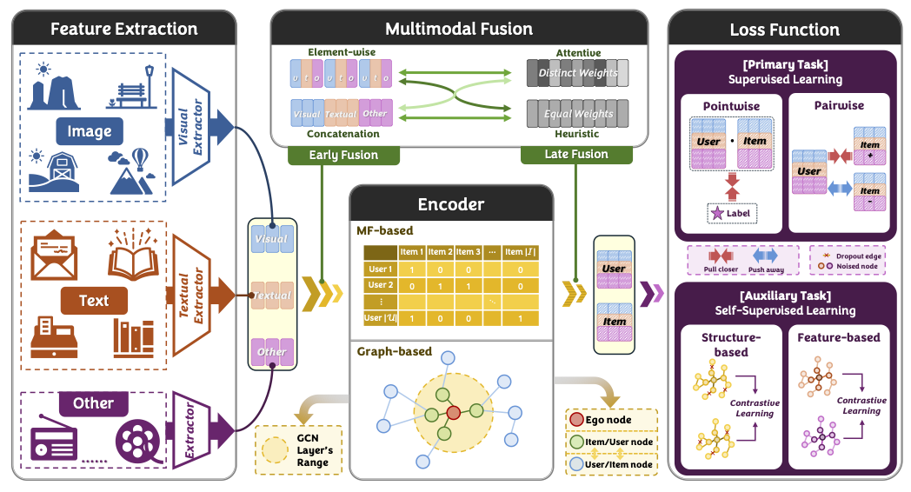

# 🚀 A Survey on Multimodal Recommender Systems:
Recent Advances and Future Directions


## Overview 

Our discussion categorizes existing MRS models into four critical aspects: **Feature Extraction**, **Encoder**, **Multimodal Fusion**, and **Loss Function**. Check out our survey 📄[A Survey on Multimodal Recommender Systems:
Recent Advances and Future Directions](https://arxiv.org/abs/2502.15711), which contains a list of papers on multimodal recommender systems.

If you find this repository helpful to your work, please kindly star it and cite our survey paper as follows:
```bibtex
@article{xu2025survey,
  title={A Survey on Multimodal Recommender Systems: Recent Advances and Future Directions},
  author={Xu, Jinfeng and Chen, Zheyu and Yang, Shuo and Li, Jinze and Wang, Wei and Hu, Xiping and Hoi, Steven and Ngai, Edith},
  journal={arXiv preprint arXiv:2502.15711},
  year={2025}
}
```




🤗 Contributions to update new resources and articles are very welcome!


## Paper List

:question: denotes cannot find implementation code. 

| Name     | Year | Publication | Paper                                                        | Code                                                         |
| -------- | ---- | ----------- | ------------------------------------------------------------ | ------------------------------------------------------------ |
| VBPR     | 2016 | AAAI        | [link](https://arxiv.org/pdf/1510.01784)                     | [code](https://github.com/arogers1/VBPR)                     |
| VMCF     | 2017 | WWW         | [link](https://dl.acm.org/doi/10.1145/3038912.3052581)       | :question:                                                   |
| ACF      | 2017 | WWW         | [link](https://dl.acm.org/doi/10.1145/3077136.3080797)       | [code](https://github.com/ChenJingyuan91/ACF)                |
| JRL      | 2017 | CIKM        | [link](https://dl.acm.org/doi/10.1145/3132847.3132892)       | [code](https://github.com/QingyaoAi/Joint-Representation-Learning-for-Top-N-Recommendation) |
| DVBPR    | 2017 | ICDM        | [link](https://arxiv.org/pdf/1711.02231)                     | [code](https://github.com/kang205/DVBPR)                     |
| GraphCAR | 2018 | SIGIR       | [link](https://dl.acm.org/doi/10.1145/3209978.3210117)       | :question:                                                   |
| VECF     | 2019 | SIGIR       | [link](https://dl.acm.org/doi/10.1145/3331184.3331254)       | [code](https://github.com/malizheng/VECF)                    |
| UVCAN    | 2019 | WWW         | [link](https://dl.acm.org/doi/10.1145/3308558.3313513)       | :question:                                                   |
| MAML     | 2019 | MM          | [link](https://dl.acm.org/doi/10.1145/3343031.3350953)       | [code](https://github.com/liufancs/MAML)                     |
| MMGCN    | 2019 | MM          | [link](https://dl.acm.org/doi/10.1145/3343031.3351034)       | [code](https://github.com/weiyinwei/MMGCN)                   |
| AMR      | 2019 | TKDE        | [link](https://ieeexplore.ieee.org/abstract/document/8618394) | [code](https://github.com/duxy-me/AMR)                       |
| MGAT     | 2020 | I&M         | [link](https://www.sciencedirect.com/science/article/abs/pii/S0306457320300182) | [code](https://github.com/zltao/MGAT)                        |
| GRCN     | 2020 | MM          | [link](https://dl.acm.org/doi/10.1145/3394171.3413556)       | [code](https://github.com/weiyinwei/GRCN)                    |
| MKGAT    | 2020 | CIKM        | [link](https://dl.acm.org/doi/10.1145/3340531.3411947)       | [code](https://github.com/QuXiaolong0812/mkgcn)              |
| IMRec    | 2021 | MM          | [link](https://dl.acm.org/doi/10.1145/3474085.3475514)       | [code](https://github.com/jiahaoxun/imrec)                   |
| PMGT     | 2021 | MM          | [link](https://arxiv.org/pdf/2010.12284)                     | [code](https://github.com/uoo723/PMGT)                       |
| LATTICE  | 2021 | MM          | [link](https://dl.acm.org/doi/10.1145/3474085.3475259)       | [code](https://github.com/CRIPAC-DIG/LATTICE)                |
| HHFAN    | 2021 | TMM         | [link](https://ieeexplore.ieee.org/document/9360479)         | :question:                                                   |
| MVGAE    | 2021 | TMM         | [link](https://ieeexplore.ieee.org/abstract/document/9535249/) | [code](https://github.com/jing-1/MVGAE)                      |
| DualGNN  | 2021 | TMM         | [link](https://ieeexplore.ieee.org/document/9662655)         | [code](https://github.com/wqf321/dualgnn)                    |
| PAMD     | 2022 | WWW         | [link](https://dl.acm.org/doi/10.1145/3485447.3512079)       | [code](https://github.com/hantengyue/PAMD)                   |
| MMGCL    | 2022 | SIGIR       | [link](https://dl.acm.org/doi/10.1145/3477495.3532027)       | [code](https://github.com/zxy-ml84/MMGCL)                    |
| ADDVAE   | 2022 | KDD         | [link](https://dl.acm.org/doi/10.1145/3534678.3539474)       | [code](https://github.com/PreferredAI/ADDVAE)                |
| EliMRec  | 2022 | MM          | [link](https://dl.acm.org/doi/10.1145/3503161.3548404)       | [code](https://github.com/Xiaohao-Liu/EliMRec)               |
| EgoGCN   | 2022 | MM          | [link](https://dl.acm.org/doi/10.1145/3503161.3548399)       | [code](https://github.com/feiyuchen7/EgoGCN)                 |
| InvRL    | 2022 | MM          | [link](https://dl.acm.org/doi/10.1145/3503161.3548405)       | [code](https://github.com/nickwzk/InvRL)                     |
| A2BM2GL  | 2022 | MM          | [link](https://dl.acm.org/doi/10.1145/3503161.3548420)       | :question:                                                   |
| HCGCN    | 2022 | MM          | [link](https://dl.acm.org/doi/10.1145/3503161.3548119)       | :question:                                                   |
| SLMRec   | 2022 | TMM         | [link](https://ieeexplore.ieee.org/document/9811387)         | [code](https://github.com/zltao/SLMRec)                      |
| DMRL     | 2022 | TMM         | [link](https://arxiv.org/pdf/2203.05406)                     | [code](https://github.com/liufancs/DMRL)                     |
| BM3      | 2023 | WWW         | [link](https://arxiv.org/pdf/2207.05969)                     | [code](https://github.com/enoche/BM3)                        |
| MMSSL    | 2023 | WWW         | [link](https://arxiv.org/pdf/2302.10632)                     | [code](https://github.com/HKUDS/MMSSL)                       |
| BCCL     | 2023 | MM          | [link](https://dl.acm.org/doi/10.1145/3581783.3612568)       | :question:                                                   |
| FREEDOM  | 2023 | MM          | [link](https://arxiv.org/pdf/2211.06924)                     | [code](https://github.com/enoche/FREEDOM)                    |
| MGCN     | 2023 | MM          | [link](https://arxiv.org/pdf/2308.03588)                     | [code](https://github.com/demonph10/MGCN)                    |
| PaInvRL  | 2023 | MM          | [link](https://arxiv.org/pdf/2308.04706)                     | :question:                                                   |
| DRAGON   | 2023 | ECAI        | [link](https://arxiv.org/pdf/2301.12097)                     | [code](https://github.com/hongyurain/DRAGON)                 |
| LGMRec   | 2024 | AAAI        | [link](https://arxiv.org/pdf/2312.16400)                     | [code](https://github.com/georgeguo-cn/LGMRec)               |
| LLMRec   | 2024 | WSDM        | [link](https://arxiv.org/pdf/2311.00423)                     | [code](https://github.com/HKUDS/LLMRec)                      |
| PromptMM | 2024 | WWW         | [link](https://arxiv.org/pdf/2402.17188)                     | [code](https://github.com/HKUDS/PromptMM)                    |
| MCDRec   | 2024 | WWW         | [link](https://dl.acm.org/doi/10.1145/3589335.3651956)       | [code](https://github.com/Yimeng-yang/MCDRec)                |
| DiffMM   | 2024 | MM          | [link](https://arxiv.org/pdf/2406.11781)                     | [code](https://github.com/HKUDS/DiffMM)                      |
| SOIL     | 2024 | MM          | [link](https://dl.acm.org/doi/abs/10.1145/3664647.3681207)   | [code](https://github.com/TL-UESTC/SOIL)                     |
| CKD      | 2024 | MM          | [link](https://dl.acm.org/doi/10.1145/3664647.3680626)       | [code](https://github.com/CRIPAC-DIG/Balanced-Multimodal-Rec) |
| GUME     | 2024 | CIKM        | [link](https://arxiv.org/pdf/2407.12338)                     | [code](https://github.com/NanGongNingYi/GUME)                |
| POWERec  | 2024 | INFFUS      | [link](https://www.sciencedirect.com/science/article/abs/pii/S1566253523003056) | [code](https://github.com/hello-dx/POWERec)                  |
| DGVAE    | 2024 | TMM         | [link](https://arxiv.org/abs/2402.16110)                     | [code](https://github.com/xiyou3368/DGVAE)                   |
| VMoSE    | 2024 | TMM         | [link](https://ieeexplore.ieee.org/document/10487870)        | :question:                                                   |
| SAND     | 2024 | arXiv       | [link](https://arxiv.org/pdf/2406.08270)                     | :question:                                                   |
| MENTOR   | 2025 | AAAI        | [link](https://arxiv.org/pdf/2402.19407)                     | [code](https://github.com/Jinfeng-Xu/MENTOR)                 |
| DOGE     | 2025 | AAAI        | [link](https://ojs.aaai.org/index.php/AAAI/article/view/33351/35506) | :question:                                                   |
| SMORE    | 2025 | WSDM        | [link](https://arxiv.org/pdf/2412.14978)                     | [code](https://github.com/kennethorq/SMORE)                  |
| MoDiCF   | 2025 | WWW         | [link](https://arxiv.org/pdf/2501.11916)                     | [code](https://github.com/JinLi-i/MoDiCF)                    |
| TARec    | 2025 | WWW         | [link](https://openreview.net/pdf?id=ss9UXxbSys)             | :question:                                                   |
| COHESION | 2025 | SIGIR       | [link](https://arxiv.org/pdf/2504.04452)                     | :question:                                                   |


## Framework

There are two open-sourced repositories for implementing multimodal recommender system models.

[MMRec](https://github.com/enoche/MMRec), [Cornec](https://github.com/PreferredAI/cornac)


## Dataset

We sorted all multimodal recommendation datasets based on scale size.

| Data           | Scale | Field              | Modality                      | link                                                         |
| -------------- | ----- | ------------------ | ----------------------------- | ------------------------------------------------------------ |
| Last.FM        | 186K+ | Music              | Visual, Textual, Audio        | [link](https://www.heywhale.com/mw/dataset/5cfe0526e727f8002c36b9d9/content) |
| Tiktok         | 726K+ | Micro-video        | Visual, Textual, Video, Audio | [link](https://paperswithcode.com/dataset/tiktok-dataset)    |
| Amazon Fashion | 1M    | Fashion            | Visual, Textual               | [link](https://jmcauley.ucsd.edu/data/amazon/)               |
| POG            | 1M+   | Fashion            | Visual, Textual               | [link](https://drive.google.com/drive/folders/1xFdx5xuNXHGsUVG2VIohFTXf9S7G5veq) |
| Taobao         | 1M+   | Fashion            | Visual, Textual               | [link](https://tianchi.aliyun.com/dataset/52)                |
| Book-Crossings | 1M+   | Book               | Visual, Textual               | [link](http://www2.informatik.uni-freiburg.de/~cziegler/BX/) |
| Douban         | 1M+   | Movie, Book, Music | Visual, Textual               | [link](https://github.com/FengZhu-Joey/GA-DTCDR/tree/main/Data) |
| Kwai           | 1M+   | Micro-video        | Visual, Textual, Video        | [link](https://zenodo.org/record/4023390#.Y9YZ6XZBw7c)       |
| Yelp           | 1M+   | POI                | Visual, Textual, POI          | [link](https://www.yelp.com/dataset)                         |
| Amazon Books   | 3M    | Book               | Visual, Textual               | [link](https://jmcauley.ucsd.edu/data/amazon/)               |
| Tianchi News   | 3M+   | News               | Textual                       | [link](https://tianchi.aliyun.com/competition/entrance/531842/introduction) |
| TMall          | 8M+   | Fashion            | Visual, Textual               | [link](https://tianchi.aliyun.com/dataset/43)                |
| MIND           | 15M+  | News               | Visual, Textual               | [link](https://msnews.github.io/)                            |
| Movielens      | 25M   | Movie              | Visual, Textual               | [link](https://grouplens.org/datasets/movielens/)            |
| MSD            | 48M+  | Music              | Textual, Audio                | [link](http://millionsongdataset.com/challenge/)             |
| Amazon         | 100M+ | E-commerce         | Visual, Textual               | [link](https://cseweb.ucsd.edu/~jmcauley/datasets.html#amazon_reviews) |